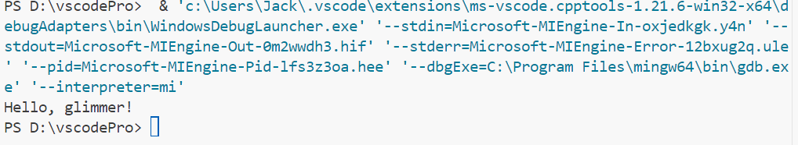

# 第一次学习
***
## 学习路径
1. 菜鸟教程
2. CSDN
3. b站
4. 教材
5. 同学
## 心得体会
***学会查资料***真的太重要了，***尝试***也是。
***
## 学习方法
问与试验相结合，例如该题问删去哪行无影响，就是试出来的。
***
## 题目&解法
1. 高级计算机语言与低级计算机语言，各有什么优劣，你更喜欢哪一类计算机语言？
    >高级语言方便人阅读，更简洁，但计算机不能直接读取,还要进行一些操作。
    >低级语言过于繁琐，但低级语言是计算机可直接读懂的。
    >我肯定更喜欢高级语言啊
2.  尝试解读hello.c中每一行的内容。
    >第一行导入标准输入输出函数库中的函数原型
    >第二行定义主函数
    >第三行打印输出hello world
    >return 0 代表程序结束时向操作系统返回0
3. 删去该程序的哪一行不会影响运行结果？
    >`return 0;`
4. int类型是计算机存储什么元素的方式？为什么main函数要使用int进行声明/定义？
    >int是存储整型元素的
    >返回0表示程序成功运行，用int定义便于检查（或者是习惯？）
5. 请调整上述程序的内容，使其输出内容Hello glimmer!并附上运行截图

***
## 课后习题思路
最开始想的是直接从较小数开始向下找，但发现可能会比较慢。后来想起高中学的辗转相除法~~（其实是查到的）~~，豁然开朗。

